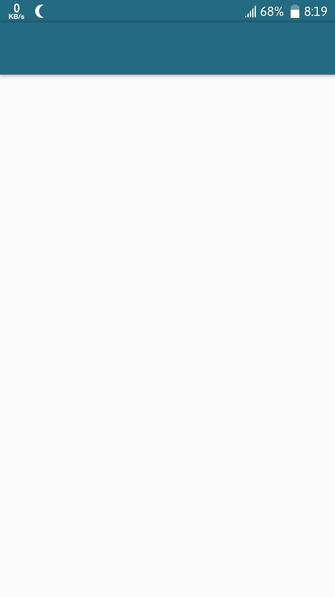

# EmptyActivityTemplate

It's a template that is Almost like Empty Activity but it has been customized status bar.




# Steps to Follow:

### 1. Please Copy All Style file into your project [style +style v21]
### 2. Copy the Colors 
### 3. Copy The Layout
### 4. You need to Download AppBarLayout into your project or add gradle dependency:

```
implementation 'com.android.support:design:27.1.1'

```

# Quick Add snippets;

## Styles:
```
 <style name="AppTheme.m_Activity" >

        <item name="colorPrimary">@color/m_colorPrimary</item>
        <item name="colorPrimaryDark">@color/m_colorPrimaryDark</item>
        <item name="colorAccent">@color/m_colorAccent</item>
    </style>


    <style name="AppTheme.NoActionBar">
        <item name="windowActionBar">false</item>
        <item name="windowNoTitle">true</item>
        <item name="colorPrimary">@color/m_colorPrimary</item>
        <item name="colorPrimaryDark">@color/m_colorPrimaryDark</item> //this is important
    </style>


    <style name="AppTheme.AppBarOverlay" parent="ThemeOverlay.AppCompat.Dark.ActionBar" />

    <style name="AppTheme.PopupOverlay" parent="ThemeOverlay.AppCompat.Light" />


```

## Styles_v21:
```
 <style name="AppTheme.NoActionBar">
        <item name="windowActionBar">false</item>
        <item name="windowNoTitle">true</item>
        <item name="android:windowDrawsSystemBarBackgrounds">true</item>
        <item name="android:statusBarColor">@android:color/transparent</item>
    </style>
```

## Color:
```

    <color name="m_colorAccent">#4FB783</color>
    <color name="m_colorPrimary">#409D9B</color>
    <color name="m_colorPrimaryDark">#226B80</color>
    
 ```
 ## layout:
 
 ```
 <android.support.v4.widget.DrawerLayout xmlns:android="http://schemas.android.com/apk/res/android"

    xmlns:tools="http://schemas.android.com/tools"
    android:id="@+id/drawer_layout"
    android:layout_width="match_parent"
    android:layout_height="match_parent"
    android:fitsSystemWindows="true"
    tools:openDrawer="start"
    android:theme="@style/AppTheme.m_Activity"> <!--//here this theme needed for changing statusBar color m_colorPrimaryDark is the Color for StatusBar and ActionBar-->

    <android.support.design.widget.CoordinatorLayout xmlns:android="http://schemas.android.com/apk/res/android"
        xmlns:app="http://schemas.android.com/apk/res-auto"
        xmlns:tools="http://schemas.android.com/tools"
        android:id="@+id/container"
        android:layout_width="match_parent"
        android:layout_height="match_parent"
        android:fitsSystemWindows="true"
        tools:context=".MainActivity">

        <android.support.design.widget.AppBarLayout
            android:id="@+id/app_bar"
            android:layout_width="match_parent"
            android:layout_height="wrap_content"
            android:theme="@style/AppTheme.AppBarOverlay">

            <android.support.v7.widget.Toolbar
                android:id="@+id/toolbar"
                android:layout_width="match_parent"
                android:layout_height="?attr/actionBarSize"
                android:background="@color/m_colorPrimaryDark"
                app:popupTheme="@style/AppTheme.PopupOverlay"  />

        </android.support.design.widget.AppBarLayout>

        <!--  <include
              android:id="@+id/include"
              layout="@layout/activity_body" />-->

    </android.support.design.widget.CoordinatorLayout>


</android.support.v4.widget.DrawerLayout>

```
 
